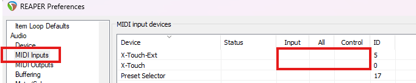
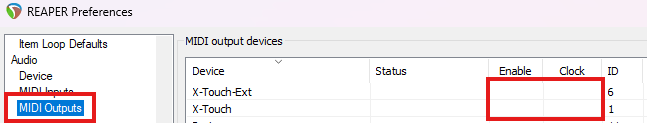
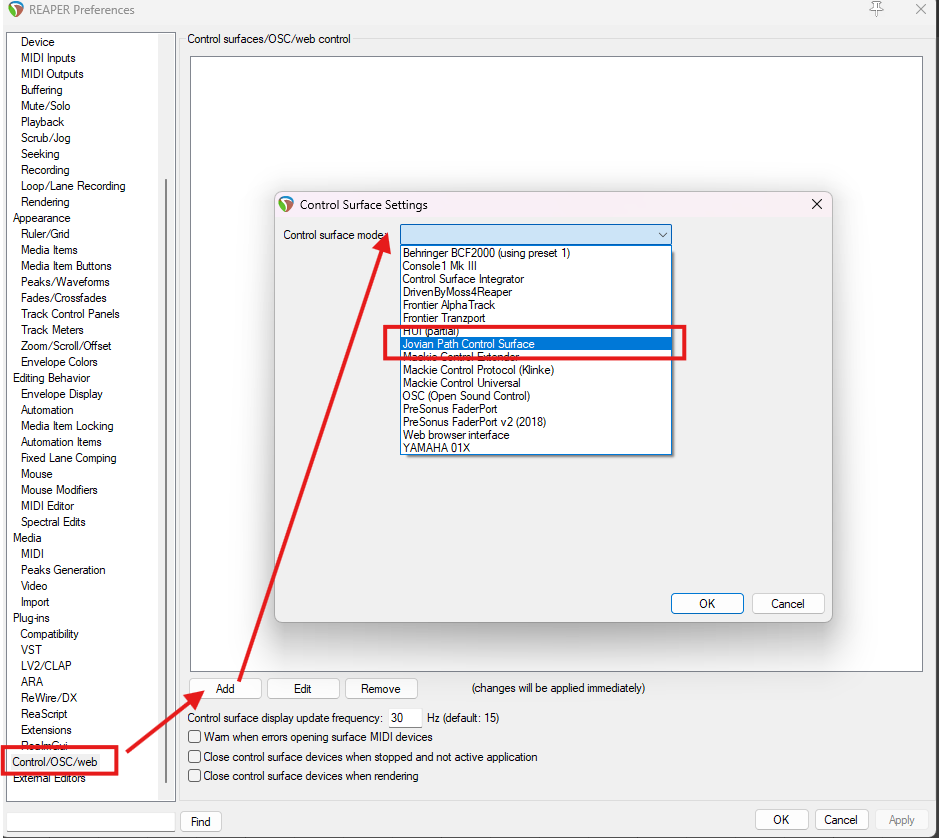

# JPRSurf User Guide

JPRSurf is a REAPER control surface extension for the Behringer X-Touch, with
optional support for an X-Touch Extender. It replaces REAPER's stock Mackie
Control support.

---

## Contents

- [Getting started](#getting-started)
- [Concepts](#concepts)
- [Always available](#always-available)
- [Track mode](#track-mode)
- [Send mode](#send-mode)
- [Cheat sheet](#cheat-sheet)

---

## Getting started

### Hardware

JPRSurf supports one X-Touch, and optionally one X-Touch Extender. An extender
is not required.

**If you use an extender, it must be physically to the left of the X-Touch.**
JPRSurf lays out the channel strips in that order: the extender's 8 strips are
channels 1-8, and the X-Touch's 8 strips are channels 9-16. There is currently
no way to put the extender on the right, or to use more than one.

Both units must be in Mackie Control (MC) mode, not HUI or standard MIDI mode.

### Installing the extension

1. Close REAPER.
2. Copy `reaper_jprsurf.dll` into REAPER's user plugins folder:
   `%APPDATA%\REAPER\UserPlugins`
   (typically `C:\Users\<you>\AppData\Roaming\REAPER\UserPlugins`).
3. Start REAPER.

JPRSurf is Windows only.

### Turning off REAPER's own MIDI handling

**This step matters.** JPRSurf opens the X-Touch's MIDI ports directly. If
REAPER also has those ports enabled, REAPER and JPRSurf will both talk to the
surface and fight over it - faders jump back, lights flicker, and buttons do
things twice.

In **Preferences > Audio > MIDI Inputs**, make sure the X-Touch devices have
**no** boxes ticked - not Input, not All, not Control:

In **Preferences > Audio > MIDI Outputs**, the same - neither Enable nor Clock:

### Adding the control surface

In **Preferences > Control/OSC/web**, click **Add**, and choose **Jovian Path
Control Surface** from the control surface mode list:

There is nothing to configure - JPRSurf has no settings in this dialog. It finds
the hardware itself, and the surface should light up as soon as you click OK.

JPRSurf locates the units by their MIDI port names, which must be exactly:

| Device           | Port name     |
| ---------------- | ------------- |
| X-Touch          | `X-Touch`     |
| X-Touch Extender | `X-Touch-Ext` |

These are the names the units report by default. If you have renamed them in
Windows, or you have more than one interface presenting a similar name, JPRSurf
will not find them.

### If something doesn't work

JPRSurf writes a log to `%APPDATA%\jprsurf.log`, which is cleared each time
REAPER starts. It lists every MIDI port it found and which ones it opened,
which is the fastest way to tell whether a naming or port problem is the cause.

If everything works except the **Save** button's light, check REAPER's undo
settings. REAPER only tracks whether a project has unsaved changes when
"undo/prompt to save" is enabled, and the light has nothing to report without
it. This is on by default, so it only comes up if you have turned it off.

---

## Concepts

### Modes

The surface is always in exactly one mode. The mode decides what the channel
strips show and what their controls do. Everything outside the strips - the
transport, the utility buttons, the timecode display, and the master fader -
works the same way in every mode.

There are two modes:

| Mode          | Shows                                                       |
| ------------- | ----------------------------------------------------------- |
| **Track**     | The tracks of your project, one per strip                   |
| **Send**      | The sends or receives of a single track, one route per strip |

The **Track** and **Send** buttons in the assign section choose the mode. Their
lights tell you both which mode you are in and which modes you can reach:

| Light    | Meaning                              |
| -------- | ------------------------------------ |
| Off      | This mode is not available right now |
| Solid    | This mode is available               |
| Blinking | This is the current mode             |

Track mode is always available, and the surface starts there. Send mode is
available when exactly one track is selected in REAPER, that track is visible
on the surface, and it has at least one send or receive.

The current mode keeps blinking even when it is no longer available. If you are
in Send mode and change the track selection, the Send button stays lit until
you leave.

### Modifiers

**Shift**, **Ctrl**, **Alt**, and **Option** in the Modify section are
modifiers. Hold one down and press something else; they never do anything on
their own. They can be combined, and several combinations have their own
meaning - Shift + Ctrl and Alt + Ctrl both do something different from either
one alone.

What a modifier does depends on what you press with it, so they are documented
with the controls they affect. Most of them are in
[Modifiers on track controls](#modifiers-on-track-controls). Shift also picks
the alternate action on each of the utility buttons.

Some ordinary buttons also act as modifiers while you hold them. Holding
**Send** in Track mode, for example, changes both what the select buttons do
and what their lights show. These are documented with the mode they belong to.

### Undo

Where REAPER allows it, one gesture on the surface is one undo point. Setting
mute across a range of twenty tracks is a single undo step, not twenty. Send
and receive volume and pan moves are collected into one undo point once you
stop moving the control.

---

## Always available

Everything in this section works the same way in both modes.

### Transport

These are the buttons in the transport section, at the bottom right of the
X-Touch.

| Button      | Short press                             | Long press        | Lit when              |
| ----------- | --------------------------------------- | ----------------- | --------------------- |
| **Rewind**  | Previous measure (see Nudge and Marker) |                   |                       |
| **Forward** | Next measure (see Nudge and Marker)     |                   |                       |
| **Stop**    | Stop                                    |                   |                       |
| **Play**    | Play / pause                            |                   | The transport is rolling |
| **Record**  | Start or stop recording                 |                   | Recording             |
| **Nudge**   | Move by beat instead of measure         |                   | Turned on            |
| **Marker**  | Move by marker instead of measure       |                   | Turned on            |
| **Cycle**   | Toggle repeat                           |                   | Repeat is on          |
| **Click**   | Toggle the metronome                    |                   | The metronome is on   |
| **Solo**    | Toggle solo in front                    | Unsolo every track | Solo in front is on  |

**Record** follows REAPER's own transport buttons. It starts recording, and
starts playback as well if the transport was stopped or paused. Pressing it
again while recording turns recording off and leaves the transport rolling.
Stopping or pausing also turns recording off.

**Nudge** and **Marker** change what Rewind and Forward do. They are not held
down - press one to turn it on, and press it again to turn it off. Each is lit
while it is on. Only one can be on at a time, so turning one on turns the
other off.

**Solo** here is the standalone button above the transport, not a channel strip
solo. A long press unsolos every track in the project.

### Timecode display

The display shows the play position, in whichever unit REAPER's ruler is set
to.

The **SMPTE/Beats** button steps through the four ruler modes, in this order:

| Mode        | Display shows          | Light       |
| ----------- | ---------------------- | ----------- |
| **Beats**   | Bars and beats         | Beats       |
| **Time**    | Minutes and seconds    | None        |
| **Frames**  | SMPTE timecode         | SMPTE       |
| **Samples** | Samples                | None        |

Pressing it again from Samples returns to Beats. The **SMPTE** and **Beats**
lights only cover two of the four modes, so when neither is lit the ruler is
in Time or Samples - read the display itself to tell which.

The **Solo** indicator light beside them lights whenever any track in the
project is soloed. It is an indicator only, not a button.

### Master fader

The X-Touch's master fader always controls the master track's volume, in every
mode. It is never re-purposed.

### Utility buttons

| Button     | Short press          | Shift + press                         | Ctrl + press        | Lit when                     |
| ---------- | -------------------- | ------------------------------------- | ------------------- | ---------------------------- |
| **Undo**   | Undo                 | Redo                                  |                     | There is something to redo   |
| **Save**   | Save project         | Save a new version of the project     |                     | Blinking: unsaved changes    |
| **Cancel** | Unselect all items   | Remove time selection and loop points |                     | Any media items are selected |
| **Enter**  | Insert new MIDI item | Insert empty item                     | Insert click source |                              |

The Cancel light follows the item selection only, which is what a plain press
clears. Shift + Cancel doesn't affect it.

All of these lights follow the current project when you switch project tabs.

### Automation buttons

The automation buttons set the automation mode of every selected track, or
REAPER's global automation override while **Group** is on (see below):

| Button    | Sets the selected tracks to |
| --------- | --------------------------- |
| **Trim**  | Trim/Read                   |
| **Read**  | Read                        |
| **Touch** | Touch                       |
| **Write** | Write                       |
| **Latch** | Latch                       |

Each press is a single undo step. With no tracks selected, a press does
nothing. The master track counts as a selected track like any other.

Each button shows how many of the selected tracks are in its mode:

| Light    | Selected tracks in the mode |
| -------- | --------------------------- |
| Off      | None                        |
| Solid    | All of them                 |
| Blinking | Some of them                |

So with a single track selected, exactly one button is solid. When the selected
tracks are in different modes, each of their modes blinks, and pressing any of
the buttons puts them all in that mode. With no tracks selected, all are off.

REAPER also has a Latch Preview mode, which has no button. Tracks in Latch
Preview light nothing, but still count as selected tracks, so a mix of Latch
and Latch Preview tracks blinks Latch.

The lights follow the current project when you switch project tabs.

#### Global automation override

REAPER's global automation override (the automation control on its transport)
makes every track behave as if it were in one mode, without changing the
tracks' own modes. It can also be **Bypass**, which ignores all automation. It
is saved with each project, and isn't an undo step.

**Group** turns the override on and off, and is lit while it is on. Turning it
on restores the last override, set from either the surface or REAPER, or
Bypass if there hasn't been one since REAPER started.

While the override is on, each mode button is lit while the override is its
mode. Pressing it sets the override to its mode, or back to Bypass if it
already was. REAPER's Latch Preview override, which has no button, blinks
Latch, and pressing Latch then sets Latch.

---

## Track mode

Track mode is the default. Each channel strip shows one track of your project.

### The channel strip

| Control             | Shows / does        |
| ------------------- | ------------------- |
| **Fader**           | Track volume        |
| **Pot**             | Track pan           |
| **Pot button**      | Reset pan to center |
| **Mute**            | Mute                |
| **Solo**            | Solo                |
| **Rec**             | Record arm          |
| **Meter**           | Track level         |
| **Scribble top**    | Track name          |
| **Scribble bottom** | Track volume, in dB |
| **Scribble color**  | Track color         |

The pot ring tells you what kind of track you are looking at. A normal track
shows its pan as a single lit position. A **folder track** lights the
far-left and far-right ring LEDs together instead, which is how the X-Touch
stands in for the dedicated indicator on the original Mackie surface. A strip
with **no track** has its ring completely off.

### Select

| Action               | Result                                                          |
| -------------------- | --------------------------------------------------------------- |
| Short press          | Select only this track (or unselect it, if it was the only one) |
| Double press         | Navigate into this track, if it is a folder                     |
| Long press           | Select the track, and anchor it for a range (see below)         |
| Ctrl + press         | Add or remove this track from the selection                     |
| Shift +  press       | Select the range from the last track you touched                |
| Shift + Ctrl + press | The same, but crossing folder boundaries                        |

A plain Shift range only covers tracks with the same parent as the starting
track. This differs from REAPER's default, and is usually what you want on a
surface - an expanded folder in the middle of the range doesn't drag its
children in. Add Ctrl for REAPER's "everything in between" behavior.

### Navigating the track list

| Button                     | Short press            | Long press                | Lit when                   |
| -------------------------- | ---------------------- | ------------------------- | -------------------------- |
| **Channel Left/Right**     | Move by one track      |                           |                            |
| **Fader Bank Left/Right**  | Move by 8 tracks       |                           |                            |
| **Global View**            | Go up one folder level | Go all the way to the top | There is a level to go up to |

A fader bank is always 8 tracks, whether or not you have an extender.

Going into a folder with a double press of select, and back out with Global
View, is how you move through a project with nested folders. Global View
centers the view on the folder you just left, so you don't lose your place. It
is dark at the top level, where there is nowhere further to go.

### Modifiers on track controls

Held while pressing **mute**, **solo**, or **rec arm**:

| Modifier         | Result                                                      |
| ---------------- | ----------------------------------------------------------- |
| *(none)*         | Toggle this track, following grouping                       |
| **Ctrl**         | Toggle this track only, ignoring grouping and ganging       |
| **Shift**        | Set the range from the last track you touched to this track |
| **Shift + Ctrl** | The same, crossing folder boundaries                        |
| **Alt**          | Clear it on every track in the project                      |
| **Alt + Ctrl**   | Clear everywhere, then set this track only                  |
| **Alt + Shift**  | Clear everywhere, then set this track, following grouping   |
| **Option**       | Toggle this track and every selected track                  |

Alt clears every track in the whole project, not just the ones on the surface,
so a mute you can neither see nor reach cannot be left behind. Alt + Ctrl is
the quickest way to solo exactly one track from anywhere.

Held while moving a **fader** or **pot**:

| Modifier | Result                                 |
| -------- | -------------------------------------- |
| **Ctrl** | Move this track only, ignoring ganging |

### Ranged actions: hold and press

Hold **select**, **mute**, **solo**, or **rec arm** on one track, and press the
same button on another track. Everything between the two is affected:

- **Select** selects exactly that range, and unselects everything else.
- **Mute**, **solo**, and **rec arm** set the whole range to the held track's
  current value. Holding mute on a muted track and pressing another mute mutes
  the range; holding it on an unmuted track unmutes the range.

Mute, solo, and rec arm anchor as soon as you press them, and the press still
does its normal job. Select anchors after a short hold, because a quick press
of two selects in a row has to stay a double press.

Each button has its own anchor, so holding mute on one track and select on
another gives you two independent ranges. Keep holding, and each further press
redoes the range from the same anchor. A range only covers tracks with the same
parent as the anchor track, and is a single undo point. Modifiers are ignored
while an anchor is held.

This is the same idea as Shift, with both ends under your fingers. Shift is
still useful when the two ends aren't on the surface at the same time.

### Holding Send

Hold the **Send** button while in Track mode and the surface turns into a map
of your routing:

- The **select lights** stop showing REAPER's selection and instead light for
  every track that has a send or a receive.
- **Pressing select** on one of those tracks jumps straight into Send mode for
  it.

Holding Send never changes your track selection, so you can hold it to look and
release it without anything happening. Releasing Send only switches mode if you
pressed it briefly.

---

## Send mode

Send mode shows the sends or receives of a **single track**. The folder
hierarchy has no meaning here; you are looking at one track's routing.

### Getting in and out

There are three ways in:

| How                                      | Result                                      |
| ---------------------------------------- | ------------------------------------------- |
| Short press **Send**                     | Show the selected track's routing           |
| Hold **Send**, press a **select** button | Show that track's routing                   |
| Select a different track in REAPER       | The view follows to the newly touched track |

Entering shows the track's **sends**, unless it has only receives, in which
case it shows those.

Press **Track** to leave. You return to Track mode with the Send mode track
visible among its siblings, wherever it lives in the project.

Master track routing and hardware outputs are not shown.

### Route strips

Every strip except the rightmost X-Touch strip shows one send or receive:

| Control             | Shows / does                                    |
| ------------------- | ----------------------------------------------- |
| **Fader**           | Route volume                                    |
| **Pot**             | Route pan                                       |
| **Pot button**      | Reset route pan to center                       |
| **Mute**            | Mute the route                                  |
| **Select**          | Jump to the track at the other end of the route |
| **Scribble top**    | The other track's name                          |
| **Scribble bottom** | Route volume, in dB                             |
| **Scribble color**  | The other track's color                         |

**Select walks the routing graph.** On a send, it takes you to the destination
track and shows its receives; on a receive, it takes you to the source track
and shows its sends. Either way you arrive at the other end of the route you
were looking at, and can keep going. This never changes REAPER's track
selection.

Rec and Solo are unused on route strips and stay dark. Strips past the last
route are empty, with their pot ring off.

**Channel Left/Right** moves by one route, and **Fader Bank Left/Right** pages
through a full screen of them at a time.

### The Info strip

The rightmost strip on the X-Touch (strip 8, or strip 16 with an extender) does
not show a route. It shows the **track whose routing you are looking at**, with
the same controls as a Track mode strip: fader, pot, pot button, mute, solo,
rec arm, meter, name, and color.

Its bottom scribble line shows **Send** or **Recv**, so you always know which
you are looking at. Its select button is unused.

This lets you watch and adjust the track itself without leaving the mode.

### Sends or receives

A short press of **Send** while in Send mode toggles between the track's sends
and its receives, starting from the first one. If the track only has one or the
other, it does nothing.

---

## Cheat sheet

### Global buttons

| Button      | Short press             | Shift + press         | Ctrl + press        | Long press                    |
| ----------- | ----------------------- | --------------------- | ------------------- | ----------------------------- |
| Undo        | Undo                    | Redo                  |                     |                               |
| Save        | Save                    | Save new version      |                     |                               |
| Cancel      | Unselect all items      | Remove time selection |                     |                               |
| Enter       | Insert MIDI item        | Insert empty item     | Insert click source |                               |
| Trim        | Selected tracks: trim/read |                    |                     |                               |
| Read        | Selected tracks: read   |                       |                     |                               |
| Touch       | Selected tracks: touch  |                       |                     |                               |
| Write       | Selected tracks: write  |                       |                     |                               |
| Latch       | Selected tracks: latch  |                       |                     |                               |
| Group       | Toggle automation override |                    |                     |                               |
| Rewind      | Previous measure        |                       |                     |                               |
| Forward     | Next measure            |                       |                     |                               |
| Nudge       | Toggle moving by beat   |                       |                     |                               |
| Marker      | Toggle moving by marker |                       |                     |                               |
| Stop        | Stop                    |                       |                     |                               |
| Play        | Play / pause            |                       |                     |                               |
| Record      | Start or stop recording |                       |                     |                               |
| Cycle       | Toggle repeat           |                       |                     |                               |
| Click       | Toggle metronome        |                       |                     |                               |
| Solo        | Solo in front           |                       |                     | Unsolo all tracks             |
| SMPTE/Beats | Cycle the ruler mode    |                       |                     |                               |
| Track       | Track mode              |                       |                     |                               |
| Send        | Send mode               |                       |                     | Show routing on select lights |

### Channel strip, by mode

| Control         | Track mode                    | Send mode route strip | Send mode Info strip |
| --------------- | ----------------------------- | --------------------- | -------------------- |
| Fader           | Track volume                  | Route volume          | Track volume         |
| Pot             | Track pan                     | Route pan             | Track pan            |
| Pot button      | Center pan                    | Center route pan      | Center pan           |
| Mute            | Track mute                    | Route mute            | Track mute           |
| Solo            | Track solo                    | -                     | Track solo           |
| Rec             | Track record arm              | -                     | Track record arm     |
| Select          | Select / into folder / anchor | Go to the other end   | -                    |
| Scribble top    | Track name                    | Other track's name    | Track name           |
| Scribble bottom | Volume                        | Route volume          | Send / Recv          |
| Meter           | Track level                   | -                     | Track level          |

### Navigation, by mode

| Button                | Track mode                  | Send mode           |
| --------------------- | --------------------------- | ------------------- |
| Channel Left/Right    | Move by one track           | Move by one route   |
| Fader Bank Left/Right | Move by 8 tracks            | Page through routes |
| Global View           | Up a level (long press: top) | -                  |
